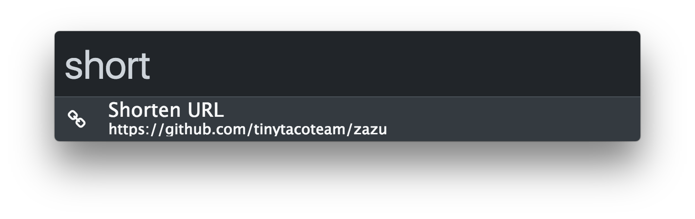
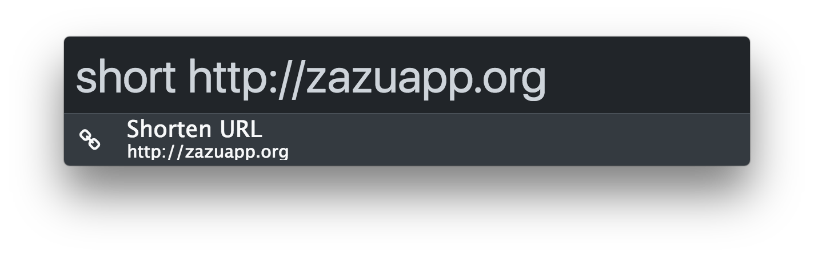

## Zazu TinyURL

Shorten url's from your clipboard or type it in manually!

## Usage

If the url is in your clipboard just type in `short`.

Type it in manually `short http://google.com` to get a short url for
`google.com`.

## Installing

~~~ json
{
  "plugins": [
    "blainesch/zazu-tinyurl",
  ]
}
~~~
